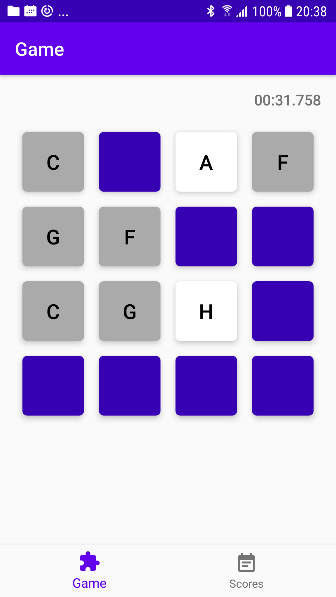

# Home Task
### Home Work for TDL Scool course

- beautiful code within the bounds of your knowledge
- RecyclerView for a grid

# Results
```
After you have completed your home work there are two options how you can
deliver your work. 
```
```
Use the upload `.zip` file function in moodle, or push the code to git. 
```
```
When pushing to git don't forget to add me as collaborator: egorbunovs `
```
```
if you mark the repo private and post the link to the git repo as text 
when submitting the work. 
```
```
Or you can also use the moodle PMs to send me info how to access the home work.
```
`Or in worst case - send me an email: edijs.gorbunovs@testdevlab.com`


# Home work option 1: Memory Game

### The app should have 3 screens:
- a menu
- a high score list
- the game view

### In the menu there must be 4 buttons:
- Easy game `2x2 grid`
- Medium game `4x4 grid`
- Hard game `4x5 grid`
- High Scores


### Hint:

- to change the grid size you must change the `span count` for the layout 
manager of the `RecyclerView` - `programmatically or with data binding in XML.`


### The game rules are as follows:

- The game grid should consist of  pairs of values (Numbers, Letters or even images - up to you). 
- Initially all the grid pieces are blank.
- When clicking on a game piece - you must uncover it and show the value that’s under the selected game piece;
- When two pieces are open, you must check if they are equal and if so - leave them open.
- If the pieces are not equal - then when selecting the next value you hide the previously selected pieces.
- The game is won once all pieces have been opened;
- In the end you should show a game over screen with the game results. 
- The highs core can be calculated either by how many guesses you had 
to make to uncover the board OR by calculating how long it took to 
uncover the board by comparing two `Date().time` values.

### Example:
`You don’t have to make it 1:1 .. especially since the example uses bottom navigation and tabs. Use the knowledge you have.`


